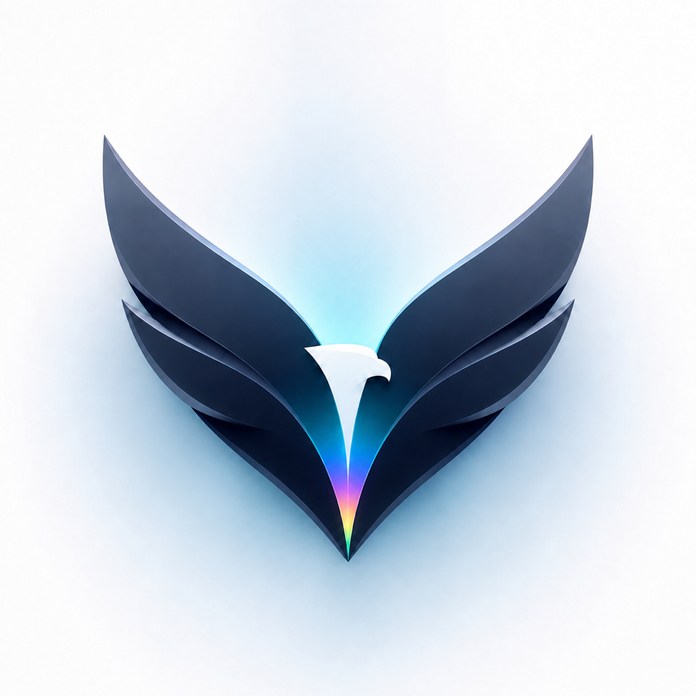

<div align="center">
  
  <h1>Eagle</h1>
  <p>Focused iOS personalization powered by DarkSword.</p>
  <p><strong>Public Beta 3 — expect unfinished features and SpringBoard resprings.</strong></p>
</div>

> [!WARNING]
> Eagle uses kernel-level and private SpringBoard capabilities. A failed or incompatible operation can respring or reboot the device. Back up important data, test one change at a time, and do not treat this beta as a production-safe utility.

## Status

The current beta has been developed and tested primarily on an **iPhone 16 Pro (iPhone17,1) running iOS 18.6.2 (22G100)**. Other combinations are not claimed as verified merely because the underlying exploit may support them.

Eagle is a modified version of [Lara](https://github.com/rooootdev/lara). The Eagle interface and feature set began diverging from Lara in August 2026. It remains distributed under the **GNU AGPL-3.0** license; see [LICENSE](LICENSE) and the acknowledgements below.

## What is included

- **Styles** — coordinated wallpaper, passcode and Wallet-card experiences.
- **Wallpapers** — community browsing, compatible package import and short-video conversion for Pocket Poster.
- **Cards** — preview, apply, back up and restore supported Wallet card artwork.
- **Passcode** — browse, import, preview, apply and restore compatible key themes.
- **Icon Studio (beta)** — icon-theme import and alternate icon shapes.
- **Dock (beta)** — layouts supporting up to six apps where SpringBoard accepts them.
- **Aura Studio (experimental)** — Island, Screen, Battery Halo, Dock and Lock lighting in one bilingual workspace, with per-surface verification.
- **Eagle System** — Guardian checks, Scenes and shareable personalization recipes.
- English and Spanish interface text.

## Known limitations

- If Island Aura reports **Safe Compact Halo**, it will not expand with music, screen recording or timers. Only **Adaptive Aura** follows those layouts.
- Aura Studio depends on private live SpringBoard surfaces. A surface can be unavailable even when another aura applies successfully.
- Battery Halo surrounds the status-bar battery area; it is not a verified replacement for the native battery fill color.
- Dock Aura geometry is currently tuned from iPhone 16 Pro testing and may still need adjustment on other screen sizes.
- Aura overlays can disappear after a SpringBoard respring or device reboot and must then be applied again.
- Icon theme importing and nonstandard masks remain device- and SpringBoard-dependent.
- Community wallpaper and passcode packages can contain unsupported structures.
- Some changes end after a respring or reboot; others require a respring before becoming visible.
- Running kernel or SpringBoard operations while the Xcode debugger is attached is intentionally blocked.

Please report what actually happened rather than repeating an operation that keeps rebooting or respringing the device.

## Try the beta

1. Download the newest prerelease IPA from [Releases](https://github.com/leonardob8777-bit/Eagle/releases).
2. Sign and install it using your preferred personal-device sideloading method.
3. Open Eagle manually from the Home Screen. If you installed through Xcode, press **Stop** before preparing Eagle access.
4. Apply one feature at a time and keep its result message.

The release IPA is provided unsigned. Eagle does not include a signing certificate or provisioning profile.

## Build from source

Requirements:

- macOS with Xcode
- `ldid` for packaging an unsigned IPA (`brew install ldid`)

Compile without installing on a device:

```sh
xcodebuild -project lara.xcodeproj \
  -scheme lara \
  -configuration Debug \
  -destination 'generic/platform=iOS' \
  CODE_SIGNING_ALLOWED=NO build
```

Package the release IPA:

```sh
./scripts/build_ipa.sh
```

The result is written to `build/Eagle.ipa`.

## Reporting a problem

Use the [bug report form](https://github.com/leonardob8777-bit/Eagle/issues/new?template=bug_report.md) and include:

- exact iPhone/iPad model;
- iOS version and build number;
- Eagle version or commit;
- the feature and selected mode;
- the exact result message;
- a screenshot when the problem is visual;
- the relevant end of `Documents/lara.log` from Eagle's Files container, with personal paths removed.

Do not publish tokens, certificates, provisioning profiles or unrelated personal files.

## Español

Eagle es una beta pública de personalización avanzada para iOS. Ha sido probada principalmente en un **iPhone 16 Pro con iOS 18.6.2**. Descarga el IPA sin firmar desde [Releases](https://github.com/leonardob8777-bit/Eagle/releases), fírmalo con tu método habitual y prueba una función a la vez. Un fallo puede provocar un respring o reinicio; conserva el mensaje mostrado y adjúntalo al reporte.

## License and acknowledgements

Eagle is licensed as a whole under [GNU AGPL-3.0](LICENSE), preserving Lara's license and notices. Source distributions and modified builds must continue to comply with that license.

Core acknowledgements include the Lara contributors, rooootdev, opa334, ChOma, XPF, AlfieCG/libgrabkernel2, DarkSword contributors, AppInstaller iOS, and the upstream projects whose license notices are kept in [`lara/licenses`](lara/licenses). See Lara's [contributor history](https://github.com/rooootdev/lara/graphs/contributors) for the complete upstream record.
